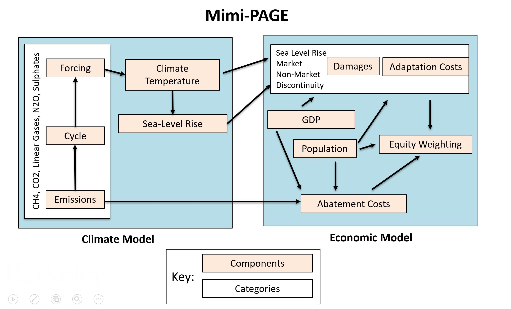

# Model Structure

## Overview

Mimi-PAGE is constructed to reproduce the PAGE09 model structure,
which features ten time periods and eight world regions. These time
periods and regions are explicitly listed below. Climate change
impacts for four sectors are calculated in addition to the costs of
mitigation-- herein referred to as abatement policies-- and the costs
of adaptation. Both impacts and costs can be computed under parameter uncertainty.

This iteration of PAGE subsets the model into twenty-seven components,
elaborated under the "Components" section below, and two basic parts:
climate and economy. There are also a number of components particular
to Mimi-PAGE which assist with certain functionalities. Within the
climate model, gases and sulphates are split into three components
each-- namely the "Cycle", "Emissions", and "Forcing" components for
that gas. Forcings are then aggregated into "Total Forcing" and feed
into "Climate Temperature". The economic model includes "Abatement
Costs", "Adaptation Costs", and "Discontinuous" impacts as well as impacts from "Sea Level Rise", "Market Damages", and "Non-Market Damages". It also features an "Equity Weighting" component.

A schematic of the model, and full listing of components, follows below.

## Time periods and regions

The ten uneven timesteps employed in Mimi-PAGE are 2009, 2010, 2020, 2030, 2040, 2050, 2075, 2100, 2150, 2200. The baseline period used, prior to any modeled results, is 2008.

The eight regions included are Europe (EU), the United States (US or USA),
other countries in the Organisation for Economic Co-operation and
Development (OT or OECD), the former Union of Soviet Socialist Republics and
the rest of Europe (EE or USSR), China and centrally planned Asia (CA
or China), India
and Southeast Asia (IA or SEAsia), Africa and the Middle East (AF or Africa), and Latin
America (LA or LatAmerica).  These parenthetical labels are used throughout the data
files and in the model specification.  Mimi-PAGE, like PAGE09, employs
the EU as a baseline region, with some processes calculated relative
to their EU values.

## Sectors and gases

The model is divided into four impact sectors: sea level rise, market
damages (called "economic damages" in PAGE09), non-market damages (called "non-economic" in PAGE09), and discontinuities. The six greenhouse gases of the Kyoto Protocol are each included via components that respectively model CO2, CH4, N2O, and a subset of low-concentration gases collectively termed "linear gases." Linear gases include HFCs, PFCs, and SF6. Sulphate forcing is also modelled.

The four impact sectors in Mimi-PAGE are modelled independently and reflect damages as a proportion of GDP. Sea level rise is a lagged linear function of global mean temperature. Both market and non-market impacts are designed to reflect the particular vulnerabilities of different regions, and use a polynomial function to reflect temperature impacts over time. Discontinuity, or the risk of climate change triggering large-scale damages, reflects a variety of different possible types of disaster.

## Components

### Climate Model

The components in this portion of Mimi-PAGE include:
- CH4 Cycle
- CH4 Emissions
- CH4 Forcing
- CO2 Cycle
- CO2 Emissions
- CO2 Forcing
- N2O Cycle
- N2O Emissions
- N2O Forcing
- Linear Gases (hereafter "LG") Cycle
- LG Emissions
- LG Forcing
- Sulphate Forcing
- Total Forcing
- Climate Temperature
- Sea Level Rise

### Economic Model

The components in this portion of Mimi-PAGE include:
- Population
- GDP
- Market Damages
- Non-Market Damages
- Sea Level Rise Damages
- Discontinuity
- Abatement Costs (for each gas)
- Adaptation Costs (for each impact sector)
- Total Abatement Costs
- Total Adaptation Costs
- Equity Weighting

### Functional Components of Mimi-PAGE

The following scripts assist in the actual running of Mimi-Page, and are further elaborated in the technical user guide.
- MimiPAGE2009.jl
- load_parameters.jl
- main_model.jl
- mctools.jl
- mcs.jl

### Schematic

